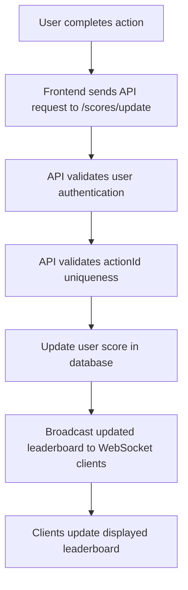

# API Service Module Specification

## Overview

This document specifies the design and functionality of the API Service module. The module will handle requests for updating user scores, retrieving the top scores, and ensuring real-time updates for the scoreboard. Additionally, it includes measures to prevent unauthorized score manipulation.

---

## Features

1. **Score Update API**:
   - Allows users to update their scores upon completing an action.
2. **Leaderboard Retrieval API**:
   - Provides the top user scores.
3. **Real-time Score Updates**:
   - Uses WebSocket to broadcast changes to the leaderboard to all connected clients.
4. **Security Measures**:
   - Implements mechanisms to prevent unauthorized score updates and detect abnormal behavior.

---

## API Endpoints

### 1. Update Score

- **Endpoint**: `/api/scoreboards`
- **Method**: PATCH
- **Authorization:** `Bearer <token>`
- **Request Body**:

  ```json
  {
    "actionId": "string"
  }
  ```

- **Response**:

  ```json
  {
    "success": true,
    "message": "Score updated successfully."
  }
  ```

- **Notes**:
  - Only authenticated users can update scores.
  - Tracking `action` to ensure each action is only used once.
  - Validates `actionId` to ensure it hasn’t been used before.
  - Updates the score in the database.

### 2. Retrieve Leaderboard

- **Endpoint**: `/api/scoreboards`
- **Method**: GET
- **Query Parameters**:
  - `limit`: Optional, defaults to 10.
- **Response**:

  ```json
  {
    "success": true,
    "data": [
      { "userId": "string", "score": 100 },
      { "userId": "string", "score": 95 }
    ]
  }
  ```

### 3. Real-time Updates (WebSocket)

- **Endpoint**: `/ws/scoreboards`

- **Functionality**:
  - Broadcasts changes to scores or the leaderboard.
  - Ensures only the affected user data is sent to reduce bandwidth.

---

## Database Schema

### Users Table

| Column   | Type    | Constraints | Notes  |
| -------- | ------- | ----------- | ------ |
| id       | UUID    | Primary Key |        |
| name     | String  |             |        |
| username | String  | Unique      |        |
| password | String  |             | Hashed |
| score    | Integer | Default = 0 |        |

### Actions Table

| Column      | Type   | Constraints | Notes |
| ----------- | ------ | ----------- | ----- |
| id          | UUID   | Primary Key |       |
| description | String |             |       |

### User Action table (Base on business case)

| Column      | Type   | Constraints | Notes |
| ----------- | ------ | ----------- | ----- |
| id          | UUID   | Primary Key |       |
| userId      | UUID   |             |       |
| actionId    | UUID   |             |       |
| description | String |             |       |

---

## Flow of Execution



---

## Improvements Suggestions

1. **Caching for Leaderboard**:
   - Use Redis to store the top scores, reducing database load during frequent requests.
2. **Rate Limiting**:
   - Implement rate limiting to prevent abuse of the `PATCH /api/scoreboards` endpoint.
3. **Audit Logging**:
   - Log all score update requests for monitoring and debugging.
4. **Action Verification**:
   - Add a server-side mechanism to validate the authenticity of `actionId` before updating scores. (Base on business case)
5. **WebSocket Scaling**:
   - Use a message broker (e.g., Redis Pub/Sub or Kafka) to support large-scale WebSocket connections.

---

## Technology Stack

- **Backend Framework**: Express.js
- **Database**: PostgreSQL
- **Real-time Communication**: Socket.IO
- **Authentication**: JWT-based authentication

---

## Deliverables

1. Fully functional APIs as per the specification.
2. Real-time WebSocket integration.
3. Database schema migrations.
4. Unit and integration tests for all features.
5. Documentation and setup instructions.

---

## Notes for Developers

- Ensure the module is extensible to add more actions in the future.
- Adhere to clean code practices and include meaningful comments.
- Test the APIs under high concurrency to ensure stability.

---
